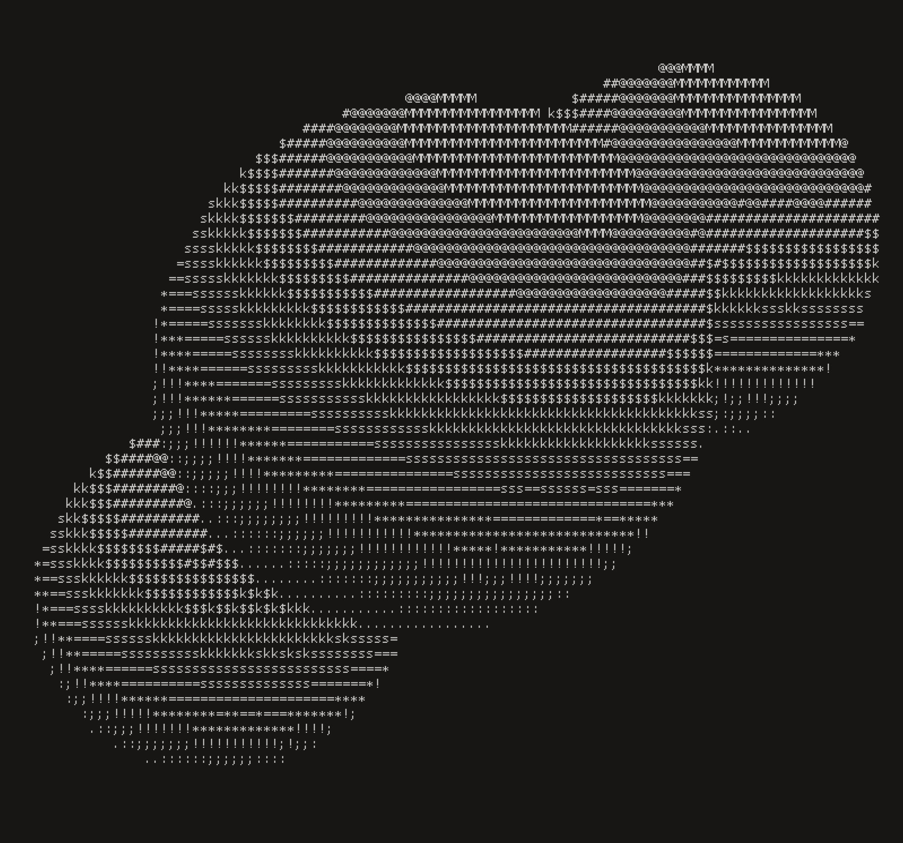

# Metablobscii

Metablobs in ASCII

Animated, ASCII-rendered real-time gooey spheroids with lighting. Or are they
metaballs?

Works on macos and linux.

## Build Instructions

```bash
make && ./metaballs
```

Inspired by demoscene canon and [ASCII
donut](https://www.a1k0n.net/2006/09/15/obfuscated-c-donut.html), written by
Andy Sloane, [A1kon](https://www.a1k0n.net/) for the Obfuscated C Contest.
Grateful for the [how it
works](https://www.a1k0n.net/2011/07/20/donut-math.html) explanation.

The trick with ASCII shading is that it can be very dependent on the font you
are using. Choosing a list of characters which provide a monotonic density
gradient is font-specific but I suppose it should look something like this:



That font is Proggy Clean, a modern, package-maintained mono-spaced font font
for a less antialiased bygone, bitmapped age.
